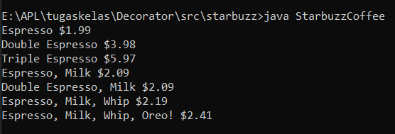
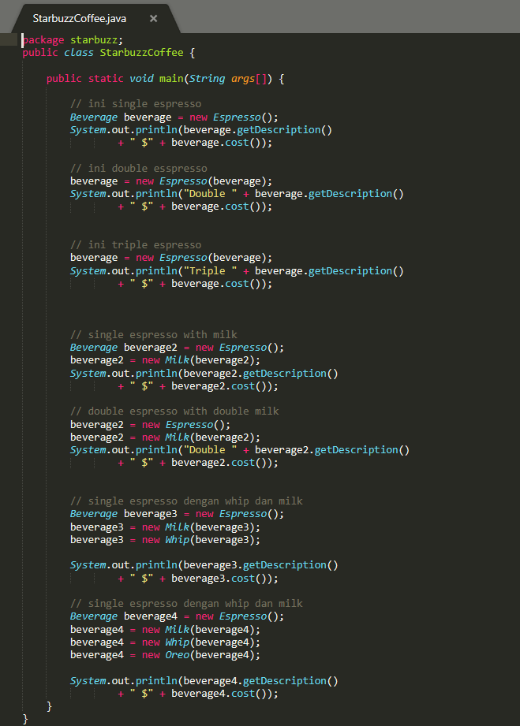

# Decorator-Pattern
## Tugas-1 Arsitektur Perangkat Lunak(APL)
Nama : M Khairul Ramadhan
NIM : 1708107010006

Compile program java StarbuzzCoffee yang ada didalam folder Decorator/src/starbuzz dengan cara
```
$ javac StarbuzzCoffee.java
```

Lalu jalankan hasil compilasi dengan cara, seperti gambar dibawah
```
$ java StarbuzzCoffee
```

Output:



Pada gambar dibawah saya melakukan beberapa percobaan:
1. Epsresso
2. Double Espresso
3. Triple Espresso
4. single Espresso with milk
5. double Espresso with milk
6. Espresso with milk and whip
7. Espresso with milk and whip and oreo


--------------------------------------------

jika tidak menggunakan IDE intellij, maka hapus package starbuzz pada baris pertama untuk menghilangkan error


